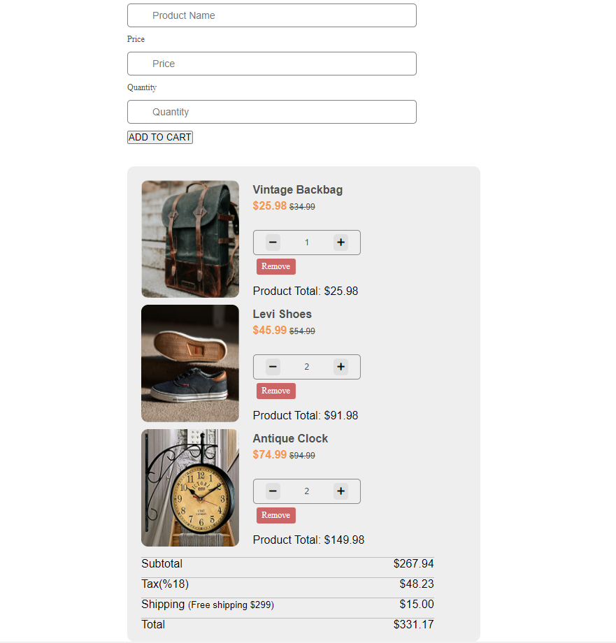
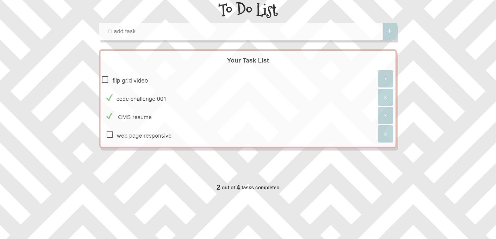
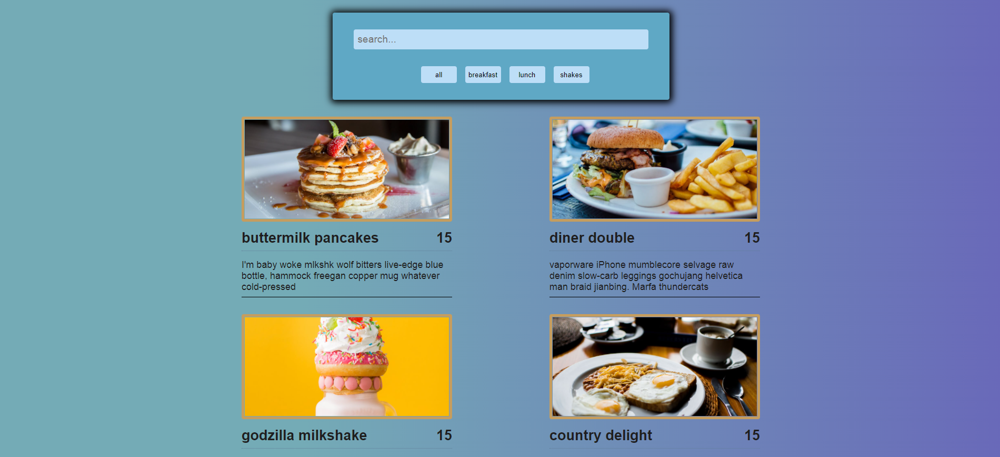

# Dynamic-Projects-with-Javascript

- [Exact Age Calculator](#exact-age-calculator)
  - I created a program that measures the time difference between the date received from the user and today.

- [Score Keeper](#score-keeper)
  - Score keeper program that ends the game at the number received from the user.

- [Number Generator](#number-generator)
  - Generates numbers up to the number it receives from the user, a program that displays odd, even and prime numbers in different colors.

- [Calculator](#calculator)
  - Calculator program designed for simple math problems.

- [Find the Number](#find-the-number)
  - It is a number guessing game.

- [Lottery Game](#lottery-game)
  - It is a kind of lottery game

- [Asian Kitchen](#asian-kitchen)
  - Button configuration was prepared with "javascript" and categorized.

- [To Do App](#to-do-app)
  - A simple to do app project

- [Student Registration](#student-registration)
  - The system that transfers the entered student information to the table

- [Checkout Page](#checkout-page)
  - Example of an e-commerce site's checkout page

- [To Do App 2](#to-do-app-2)
  - My another to do app project

- [Dynamic Search Bar](#dynamic-search-bar)
  - Search bar application that dynamically brings the searched product

 
 

## Exact Age Calculator

 
 

## Score Keeper

 
 

## Number Generator

 
 

## Calculator

 
 

## Find the Number

 
 

## Lottery game

 
 

## Asian Kitchen

 
 

## To Do App

 
 

## Student Registration

 
 

## Checkout Page

 
 

## To Do App 2

 
 

## Dynamic Search Bar

